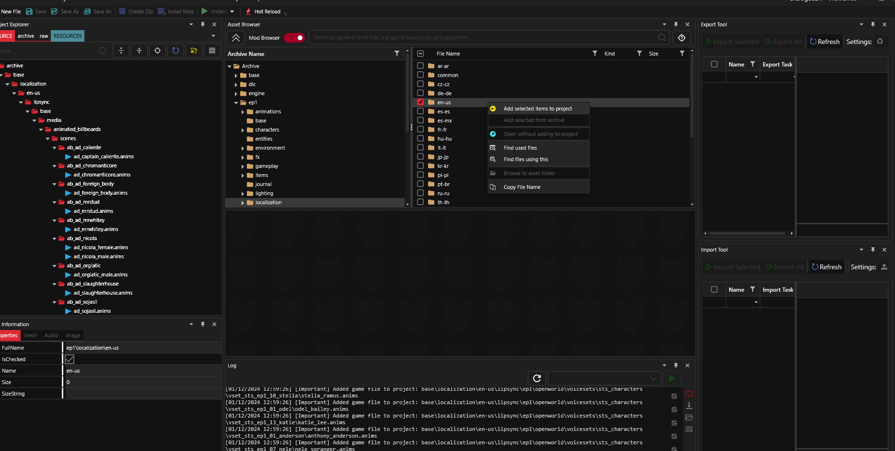
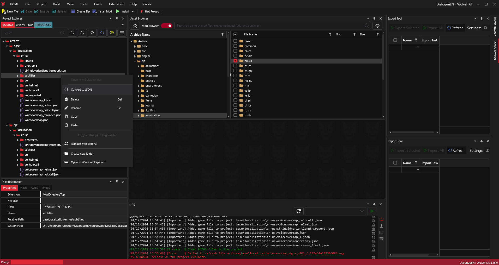
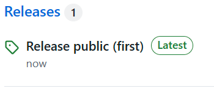
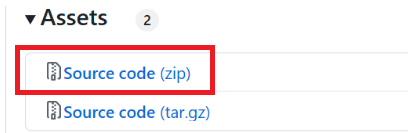
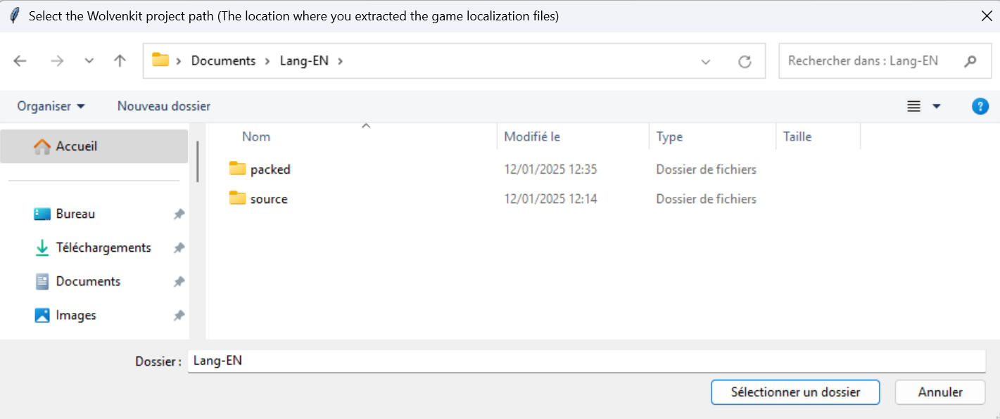
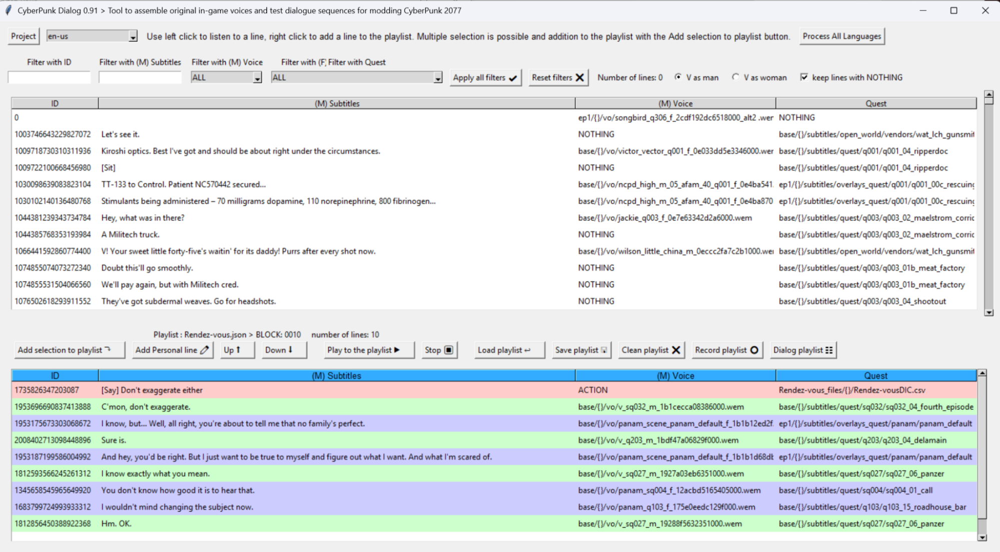
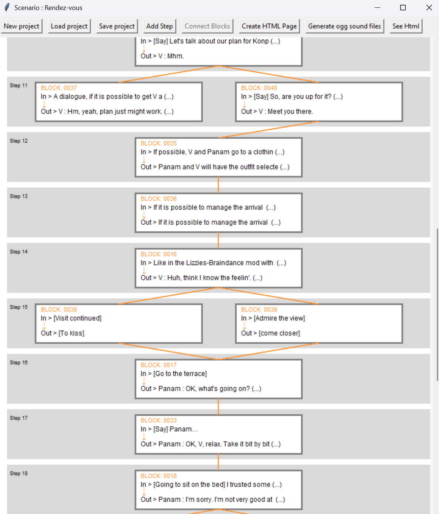
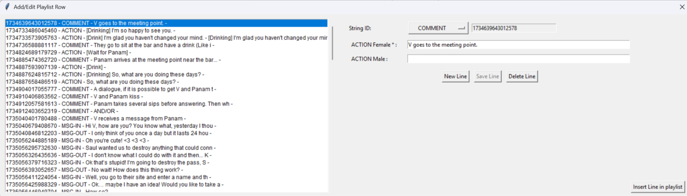

How to use Cyberpunk-Voices?

**Step 1:**   
With Wolvenkit ( [https://www.nexusmods.com/cyberpunk2077/mods/2201](https://www.nexusmods.com/cyberpunk2077/mods/2201) )

Create a Wolvenkit project somewhere you have space: a few dozen GB may be needed.

Add selected items to project for : 

- base/localisation/**en-us**   
- ep1/localisation/**en-us**  

(or the language that you want \!  
	"de-de": "Deutsch",  
	"en-us": "English",  
	"es-es": "Spanish",  
	"fr-fr": "Français",  
	"it-it": "Italiano",  
	"jp-jp": "日本語 (Japanese)",  
	"kr-kr": "한국어 (Korean)",  
	"pl-pl": "Polish",  
	"pt-br": "Português",  
	"ru-ru": "Russian",  
	"zh-cn": "中文 (Simplified Chinese)"

This operation can be long, because there are tens of thousands of audio files for a language\!  
You will need to allow approximately 10GB of disk space for each language you choose to extract from the game.

**Step 2:**   
With Wolvenkit, convert to JSON all the subtitle for : 

- base/localisation/en-us/subtitles   
- ep1/localisation/en-us/subtitles 

**Step 3:** Check if Python is on your system

You need to have Python on your system, if you don't have it:  
Official Python Link: [https://www.python.org/downloads/](https://www.python.org/downloads/)

**Step 4:** Get the Cyberpunk-Voices python files  
Go to the project page on github [https://github.com/PLeray/CyberPunk-Voices](https://github.com/PLeray/CyberPunk-Voices)  

and download the Source code : 

  
and extract the files wherever you want:

**Step 5:** Launch Cyberpunk-Voices  
In the "Cyberpunk-Voices-main" folder Open a command prompt with cmd.exe.  
and type: **python.exe main.py**  
or launch CyberPunk-Voices.bat (Which does the same thing…)

The software starts and you will have to specify where the files you extracted from the game with Wolvenkit are located.  
\>Start Cyberpunk-Voices  
   
Then the program recreates a "dictionary" file by language once. This operation is long, but is done only once, so that it works faster afterwards.

Main window to search and gather voices in vo in dialogue  
\>Cyberpunk-Voices main frame  
   
The top list corresponds to the game's voices in vo and action phrases, there are a little less than 100,000 of them\!

The list below (playlist) corresponds to the vo that you select and add from the list above. It is possible to listen to each line.

The project window allows you to assemble different playlists to create a scenario with different possible choices for V.

\> Cyberpunk-Voices project frame  
  

La fenêtre Manual Line vous permet d'ajouter de nouvelles phrases à votre scénario pour par exemple spécifier les actions à réaliser par V, comme s'asseoir, dire quelque chose,... mais aussi pour ajouter des messages texte et des commentaires.  
\>Cyberpunk-Voices Manual Lines frame

   
These items can be added to a .quest file.  
(Not comments which have no reason to be in a .quest file\!)

Here is a scenario made with this tool:
https://pleray.github.io/CyberPunk-Voices/data/projects/Rendez-vous_files/localization/en-us/Rendez-vous.html

